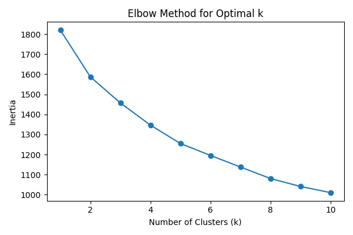
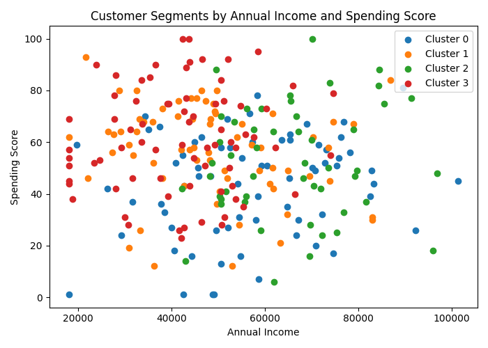

# Customer Segmentation

## Project Overview
This project analyzes customer data to identify meaningful customer segments based on behavioral and transactional patterns. The workflow includes data cleaning, exploratory data analysis (EDA), feature preparation, feature scaling, K-Means clustering, and business interpretation.

## Objective
The goal is to group customers into distinct segments using clustering techniques and interpret these segments in a way that supports business decision-making.

## Dataset Description
The dataset contains customer-level information such as:
- age
- annual income
- spending score
- tenure in months
- purchase frequency
- average order value
- product category preference
- region
- online activity score
- loyalty membership

The project uses these features to discover natural customer groups.

## Project Workflow
1. Data loading and inspection
2. Data cleaning
3. Exploratory data analysis
4. Feature selection for clustering
5. Feature scaling
6. Elbow Method for choosing the number of clusters
7. K-Means clustering
8. Cluster interpretation
9. Business recommendations

## Data Cleaning
The cleaning process included:
- handling missing values
- removing duplicate rows
- standardizing inconsistent categorical values
- correcting invalid numerical entries

## Key Findings
The clustering analysis identified four meaningful customer segments:
- Low-Engagement Customers
- High-Engagement Active Customers
- High-Income Premium Customers
- Loyal Value-Driven Customers

## Business Recommendations
Based on the segmentation results, the company could consider:
- re-engagement campaigns for low-engagement customers
- loyalty rewards and premium offers for highly engaged customers
- upselling strategies for high-income premium customers
- retention-focused communication for loyal value-driven customers

## Tools & Libraries
- Python
- pandas
- NumPy
- scikit-learn
- matplotlib
- Google Colab

## Repository Structure
data/
  raw/
  processed/
notebooks/
images/
README.md
requirements.txt

## Visualizations

### Elbow Method

### Customer Segments by Annual Income and Spending Score

## Author
Nađa Radojičić
